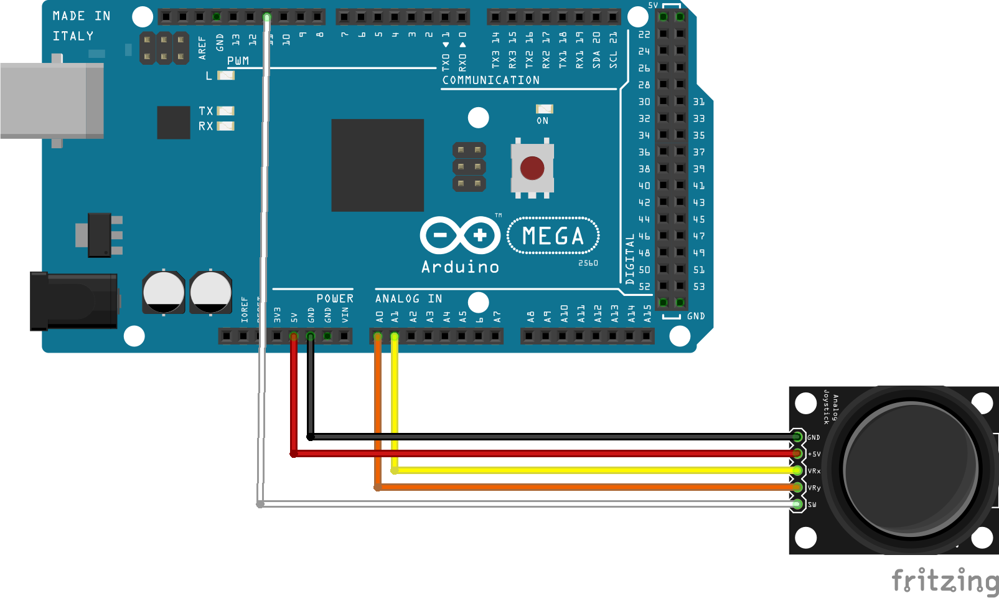

# Real-time plot of analog joystick readings using pyqtgraph

In this project, the analog signals of a joystick module are plotted in real-time using the Python's pyqtgraph library. The joystick signals are processed using an Arduino Microcontroller.

## Table of contents

   * [Arduino set-up](#Arduino set-up)
   * [Real-time plotting using pyqtgraph](#table-of-contents)

## Arduino set-up

The following image shows the Arduino schmetics to work with a commonly available [joystick](https://www.amazon.de/AZDelivery-Joystick-KY-023-Arduino-gratis/dp/B07CKCBHF4/ref=sr_1_1_sspa?ie=UTF8&qid=1538845699&sr=8-1-spons&keywords=joystick+arduino&psc=1) module. These joysticks basically consist of two [potentiometers](https://en.wikipedia.org/wiki/Potentiometer) (for x- and y-axis) as well as a single button (z-direction).

<!-- 

 --->
The five pins of the joysticks are connected as follows:

|Arduino schematics|Pin connections|
|--|--|
|| <table> <tr><th>Pins Joystick</th><th>Pins Arduino</th></tr><tr><td>GND</td><td>GND</td></tr><tr><td>+5V</td><td>5V</td></tr><tr><td>VRx</td><td>A1</td></tr><tr><td>VRy</td><td>A0</td></tr><tr><td>SW</td><td>11</td></tr> </table>|

The corresponding Arduino [code](joystick_readings.ino) simply reads the analog values of the joystick and prints them on the serial port to be accessable by Python.

## Real-time plotting using pyqtgraph
